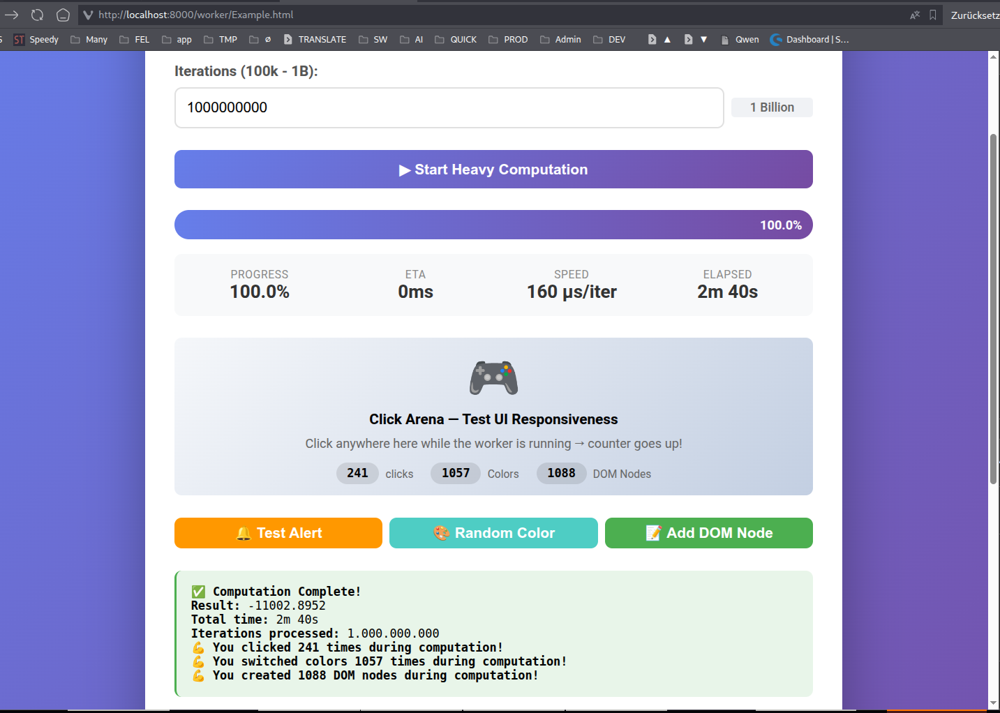

# YaiWorker

**Ultra-lightweight WebWorker manager** (<1KB gzipped) with zero build tools, native ES modules, and seamless YEH event integration.

---

## 🚀 Quick Start

```bash
npm install @yaijs/core
```

```javascript
import YaiWorker from '@yaijs/core/worker';

// One-shot computation
const result = await YaiWorker.run(
  (data) => data.items.filter(x => x.active).map(x => x.value),
  { items: [...] }
);
```

---

## 📖 Core Concepts

### 1. Serialized Task Execution

Pass any pure function — it's automatically serialized and runs in a WebWorker.

```javascript
const worker = new YaiWorker(
  (inputData, taskId) => {
    // No DOM access here! Pure computation only.
    return inputData.map(x => x * 2);
  },
  { targetElement: button }
);

const result = await worker.start([1, 2, 3]);
```

---

## ⚡ Performance & Benchmarks

YaiWorker handles high-throughput mathematical transformations, deep arrays, and data serialization entirely off the main thread.

Below is a live execution log crunching **1 Billion sequential iterations** without losing a single frame of DOM animation or blocking UI event interactions:



* **UI Responsiveness:** 0% main-thread execution pressure. Over 1,000 local color changes and dynamic DOM nodes were painted fluidly by the user while computation ran at maximum CPU capacity.
* **JIT Acceleration:** Pure, self-contained functions are compiled natively into machine code execution pipelines inside the worker engine context.

---

### 2. YEH Event Integration

Results bubble as native `CustomEvent`s from your target element.

```javascript
const worker = new YaiWorker(heavyTask, { targetElement: button });

const yeh = new YEH({
  '#my-button': [{ type: 'worker:success', handler: 'onComplete' }]
});

// Or native DOM
button.addEventListener('worker:success', (e) => {
  console.log('Result:', e.detail.payload);
});
```

### 3. Progress Updates

Your worker can send progress reports using the provided `taskId`. The `onProgress` callback receives the **exact payload** you send from the worker.

```javascript
const worker = new YaiWorker(async (data, taskId) => {
  for (let i = 0; i <= 100; i++) {
    // Send progress update with the taskId from the second parameter
    self.postMessage({ taskId: taskId, status: 'progress', payload: i });
    await new Promise(r => setTimeout(r, 10));
  }
  return 'done';
}, { onProgress: (progressValue) => console.log(`Progress: ${progressValue}%`) });
```

---

## 🎛️ API Reference

### `new YaiWorker(task, options)`

| Parameter | Type | Description |
|-----------|------|-------------|
| `task` | `Function \| string` | Pure function to run in worker |
| `options.mode` | `'transient' \| 'persistent'` | Default: `'transient'` (auto-cleanup) |
| `options.targetElement` | `HTMLElement` | Dispatch `CustomEvent` from this element |
| `options.importScripts` | `string[]` | External scripts to load in worker |
| `options.transferables` | `ArrayBuffer[]` | Zero-copy transfer list |
| `options.onProgress` | `Function` | Progress callback |
| `options.abortSignal` | `AbortSignal` | External cancellation |
| `options.allowThis` | `boolean` | Allow `this` references (risky) |

### `YaiWorker.run(task, inputData, options)`
Static one-shot execution. Auto-terminates.

### `worker.start(inputData, transferables)`
Returns `Promise<result>`.

### `worker.terminate()`
Kills worker, revokes blob URL, rejects pending promise with `AbortError`.

---

## 🧩 Integration with YEH

YaiWorker dispatches native `CustomEvent`s on your `targetElement`:

| Event | Detail property | When |
|-------|----------------|------|
| `worker:success` | `{ taskId, payload, originElement }` | Computation completes |
| `worker:error` | `{ taskId, payload, originElement }` | Worker throws |

YEH listens to these natively — no extra wiring needed.

---

## 🔧 Advanced Patterns

### Persistent Worker (Stateful Background Task)

For persistent workers, state must live on the worker's global scope (`self`), allowing consecutive `.start()` calls to mutate it.

```javascript
const worker = new YaiWorker(
  async (inputData, taskId) => {
    // Initialize state on the worker's global scope if it doesn't exist
    self.workerState = self.workerState ?? 0;
    self.workerState += inputData;
    return self.workerState;
  },
  { mode: 'persistent' }
);

await worker.start(5);  // returns 5
await worker.start(3);  // returns 8
await worker.start(10); // returns 18
```

### Zero-Copy with Transferables

```javascript
const buffer = new ArrayBuffer(1024 * 1024 * 10); // 10MB
const result = await YaiWorker.run(
  (buffer) => new Uint8Array(buffer).reduce((a,b) => a + b, 0),
  buffer,
  { transferables: [buffer] }
);
// buffer is now detached on main thread
```

### CSP-Restricted Environments (Chrome Extensions)

Place `/assets/yai-worker-bridge.js` in your public folder. Detection is automatic.

---

## 🧪 Live Demo

[DOM-to-WebWorker Event Bridge on JSFiddle](https://jsfiddle.net/j1u4rzno/) — Type to trigger prime number computation off the main thread.
[YaiWorker Demo](https://yaijs.github.io/yai/worker/Example.html) - Self-calibrating progress bar

---

## 📚 Deep Dives

- [Architectural Pattern: DOM-to-Worker](./DOM-TO-WORKER-PATTERN.md) — How YEH + WebWorkers create non-blocking UIs
- [Origin Story](./archive/ORIGIN.md) — How YaiWorker was engineered across 5 LLMs and an orchestrator
- [Implementation Blueprint](./archive/IMPLEMENTATION.Blueprint.md) — Technical specification

---

## 📦 Architecture

```
┌─────────────┐     ┌──────────────┐     ┌─────────────┐
│  Main       │     │  YaiWorker   │     │  WebWorker  │
│  Thread     │────▶│  (Blob URL)  │────▶│  (Isolated) │
│             │     │              │     │             │
│  YEH ◀──────│─────│ CustomEvent  │◀────│ postMessage │
└─────────────┘     └──────────────┘     └─────────────┘
```

- **Zero dependencies** (except optional YEH)
- **Zero build tools** — pure ES modules + Classic Workers
- **Memory safe** — WeakRef tracking + URL revocation
- **CSP fallback** — auto-detects and switches to asset path

---

## 📄 License

MIT © YaiJS

---

## 🏆 Stress Test Results

| Iterations | Time | UI Clicks | Result |
|------------|------|-----------|--------|
| 1,000,000,000 | 2m 29s | 164 | ✅ Stable |
