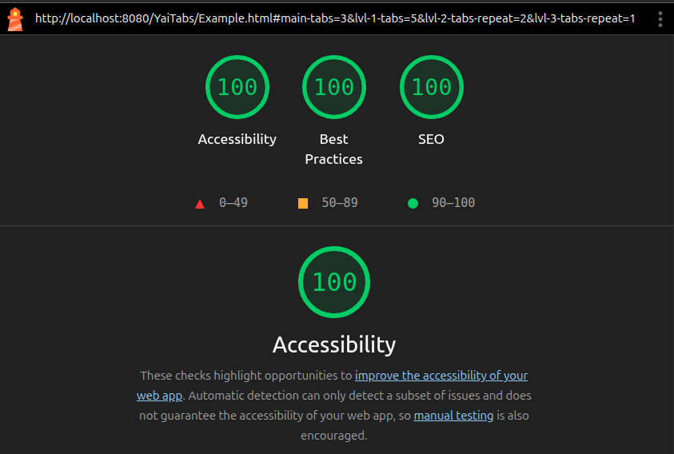
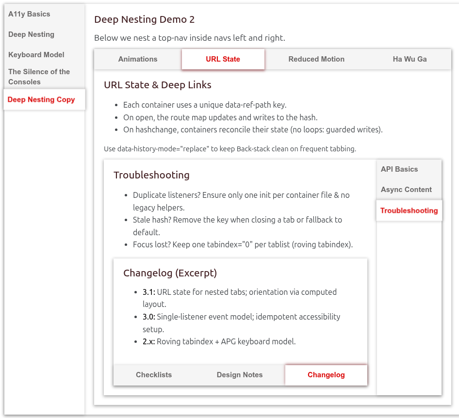

# YaiTabs - Tab Component with Nested Support

A tab component system that supports unlimited nesting, dynamic content loading, and URL-based routing. Built on YpsilonEventHandler's event delegation architecture.

## 🚀 Quick Start

```html
<!-- Include dependencies -->
<script src="https://cdn.jsdelivr.net/npm/@yaijs/yeh"></script>
<script src="../yai-core.js"></script>
<script src="yai-tabs.js"></script>
<link rel="stylesheet" href="yai-tabs.css">

<!-- Basic tab component -->
<div data-yai-tabs data-nav="top">
  <nav data-controller>
    <button data-tab-action="open" data-open="1" data-default>Tab 1</button>
    <button data-tab-action="open" data-open="2">Tab 2</button>
  </nav>
  <div data-content>
    <div data-tab="1">Content 1</div>
    <div data-tab="2">Content 2</div>
  </div>
</div>

<script>
  const tabs = new YaiTabs();
</script>
```

## Core Features

- **Nested tab support** - Tabs can contain other tab components without performance degradation
- **Dynamic content loading** - Load tab content via fetch with loading states
- **URL routing** - Deep link to nested tab states via hash parameters
- **Themeable design** - CSS custom properties with built-in themes and color schemes
- **Multiple animations** - 8 built-in animation behaviors plus instant mode
- **Accessibility** - Full ARIA implementation with keyboard navigation
- **Auto-disambiguation** - Optional feature to ensure unique IDs across nested components

## Architecture

### Event Delegation Hierarchy
```
• YaiTabs (Root)           → 2 event listeners
  ├─ YaiTabs (nested)      → 0 listeners (inherits)
  │  ├─ YaiTabs (level 3)  → 0 listeners (inherits)
  │  └─ Dynamic YaiTabs    → 0 listeners (inherits)
  └─ YaiTabs (sibling)     → 0 listeners (inherits)
```

All nested and dynamically added components utilize the root component's event listeners. Nested components are not "registered" as separate entities - they exist as DOM structures that respond to events delegated from their root ancestor. This allows dynamic HTML injection to work immediately without requiring component re-initialization, as the root listeners continue monitoring their entire DOM territory regardless of structural changes.

### Event Handling
- Uses 2 event listeners per root component (click + keydown)
- Nested components inherit event handling from parent
- Dynamic content requires no additional listeners
- No cleanup needed, only root components are registered
- Performance remains constant regardless of nesting depth

### Component Lifecycle
1. Components with `[data-yai-tabs]` are detected on page load
2. Root components initialize with event listeners
3. Nested components are processed as lightweight delegates
4. Dynamic content integrates with existing event structure

## 📋 Component Structure

### Container Attributes
```html
<div
  data-yai-tabs
  data-yai-tabs-lazy
  data-theme="default"
  data-color-scheme="red"
  data-behavior="fade"
  data-nav="top"
  data-history-mode="replace"
  data-ref-path="main-tabs"
>
```

| Attribute | Purpose | Values |
|-----------|---------|--------|
| `data-yai-tabs` | Marks as tab component | (required) |
| `data-yai-tabs-lazy` | Alter initialization for nested tabs (use instead of `data-yai-tabs`) | (presence only) |
| `data-theme` | Theme/look | `default` (or override) |
| `data-color-scheme` | Color variant | `red`, `blue`, `light`, `dark`,  (or custom) |
| `data-behavior` | Transition effect | `fade`, `slide-*`, `blur`, `zoom`, `flip`, `instant` |
| `data-nav` | Navigation position | `top`, `right`, `bottom`, `left` |
| `data-history-mode` | Browser history handling | `replace`, `push` |
| `data-ref-path` | URL hash parameter key | Unique identifier |

### Navigation Controller
```html
<nav
  data-controller
  data-align="start"
  data-grow
  aria-label="Special Demo Tabs"
>
```

| Attribute | Purpose | Values |
|-----------|---------|--------|
| `data-controller` | Marks navigation element | (required) |
| `data-align` | Button alignment | `start`/`left`, `center`, `end`/`right` |
| `data-grow` | Button width behavior | (presence enables flex-grow) |
| `aria-label` | Accessibility label | Custom description |

### Tab Buttons
```html
<button
  data-tab-action="open"
  data-open="1"
  data-default
  data-delay="500"
  data-post-delay="300"
  data-min-loading="800"
  data-url="dynamic/content.html"
  data-url-refresh
  data-restore-text="WILL_BE_RESTORED_AFTER_LOAD"
>
```

| Attribute | Purpose | Values |
|-----------|---------|--------|
| `data-tab-action` | Button action type | `open` (required) |
| `data-open` | Target panel ID | Matches `data-tab` value |
| `data-default` | Initial active tab | (presence only) |
| `data-delay` | Pre-fetch delay | Milliseconds (before request starts) |
| `data-post-delay` | Post-fetch delay | Milliseconds (after content loads) |
| `data-min-loading` | Minimum loading time | Milliseconds (prevents flicker) |
| `data-url` | Dynamic content URL | Relative/absolute path |
| `data-url-refresh` | Always reload content | (presence only) |
| `data-restore-text` | Text to restore after loading | String value restored to button |

#### Dynamic Content Loading Features

**Text Restoration**: The `data-restore-text` attribute preserves the original button text during loading operations:

```html
<!-- Before loading: button shows "Load Content" -->
<button
  data-tab-action="open"
  data-open="dynamic"
  data-url="content.html"
  data-restore-text="Load Content">
  Load Content
</button>

<!-- During loading: text may change to "Loading..." -->
<!-- After loading: automatically restored to "Load Content" -->
```

**Loading Delay Control**:
- `data-delay="500"` - Wait 500ms before starting fetch request
- `data-post-delay="300"` - Wait 300ms after content loads before display
- `data-min-loading="800"` - Show loading state for minimum 800ms (prevents flicker)

### Content Panel
```html
<div data-content>
  <div data-tab="1" data-spaceless>
    <!-- Content -->
  </div>
</div>
```

| Attribute | Purpose | Values |
|-----------|---------|--------|
| `data-content` | Content wrapper | (required) |
| `data-tab` | Panel identifier | Matches `data-open` value |
| `data-spaceless` | Remove default padding | (presence only) |

## ⚙️ Configuration Options

```js
const tabs = new YaiTabs({
  closable: true,           // Allow closing tabs
  openDefault: null,        // Default tab index if none specified
  defaultBehavior: 'fade',  // Default animation behavior
  autoFocus: false,         // Auto-focus first tab
  autoAccessibility: true,  // Automatic ARIA attributes
  autoDisambiguate: false,  // Ensures unique IDs across nested components

  events: {
    enableStats: false,
    autoTargetResolution: true,
    actionableAttributes: ['data-tab-action'],
    actionableClasses: [],
    actionableTags: [],
  }
});
```

## 🔧 Lifecycle Hooks

```js
// Available callback hooks
this.config = {
  callbacks: {
    setLoading: null,     // When loading state should be applied
    removeLoading: null,  // When loading state should be removed
    contentReady: null,   // When content is ready for animation
    afterLoad: null,      // After everything completes
  },
}

// Usage example
this.hook('setLoading', ({ container, isLoading, target }) => {
  // Custom loading implementation
});
```

## 🎨 CSS Customization

YaiTabs uses CSS custom properties for theming:

```css
:root {
    /* Layout & spacing */
    --yai-content-padding: 20px;
    --yai-content-line-height: 1.5;
    --yai-content-min-height: 80px;
    --yai-button-padding: 2px 20px;
    --yai-button-min-height: 42px;

    /* Closed state */
    --yai-closed-text: "YaiTabs";
    --yai-closed-align: center;
    --yai-closed-timeout: .5s;

    /* Loader */
    --yai-loader-speed: 1.1s;
    --yai-loader-button-size: 12px;
    --yai-loader-content-size: 32px;

    /* Color scheme */

    /* Core color palette */
    --yai-primary: #127cdc;
    --yai-primary-dark: #0a0a56;
    --yai-secondary: #383896;
    --yai-accent: #e3260d;
    --yai-danger: #e3260d;

    /* Semantic colors */
    --yai-text: #302c41;
    --yai-text-muted: #6b6969;

    --yai-bg: #ffffff;
    --yai-bg-surface: #f8f8f8;
    --yai-bg-surface-alt: #f5f5f5;
    --yai-bg-overlay: #efefefd7;

    --yai-focus: #2563eb;
    --yai-focus-dark: #1e40af;

    --yai-shadow: #32323266;
    --yai-shadow-accent: #801a2199;

    --yai-tabs-nav-bg: var(--yai-bg);
    --yai-tabs-content-bg: var(--yai-bg-overlay);
    --yai-tabs-active-bg: var(--yai-bg);
    --yai-loader-color: var(--yai-secondary);
}
```

Simple override, will set containing components automatically through inheritcance, but can be overridden per component.

```css
[data-color-scheme="red"] {
    --yai-accent: #e3260d;
    --yai-danger: #e3260d;
    --yai-shadow-accent: #801a1a99;
}

[data-color-scheme="blue"] {
    --yai-accent: #1f53ff;
    --yai-shadow: #1a408099;
    --yai-shadow-accent: #1a408099;
}

[data-color-scheme="dark"] {
    --yai-primary-dark: #eeeeee;
    --yai-secondary: #d6d6ff;
    --yai-accent: #ff4746;
    --yai-text: #ffffff;
    --yai-text-muted: #cec6c6;
    --yai-bg: #252525;
    --yai-bg-surface: #2d2d2d;
    --yai-bg-surface-alt: #3d3d3d;
    --yai-bg-overlay: #353535;
    --yai-shadow: #99999971;
    --yai-shadow-accent: #71626299;
    --yai-tabs-nav-bg: var(--yai-bg);
    --yai-tabs-content-bg: var(--yai-bg-overlay);
    --yai-tabs-active-bg: var(--yai-bg);
    --yai-loader-color: var(--yai-secondary);
}
```

Complete theme overrides

```css
[data-theme="minimal"] {
    box-shadow: none;

    & nav[data-controller] {
        box-shadow: none;
        background: transparent;

        & button {
            background: transparent;
            border-radius: 0;
            border-bottom: 2px solid transparent;

            &.active {
                box-shadow: none;
                border-bottom-color: var(--yai-accent);
            }
        }
    }
}

[data-theme="pills"] {
    box-shadow: none;

    & nav[data-controller] {
        box-shadow: none;
        background: transparent;
        gap: 4px;

        & button {
            background: var(--yai-bg-surface);
            border-radius: 20px;
            margin: 0 2px;

            &.active {
                background: var(--yai-accent);
                color: var(--yai-text-inverted);
                box-shadow: 0 2px 4px var(--yai-shadow);
            }
        }
    }
}
```

## 🔍 Debugging & Monitoring

Check event listeners after initialization ([Example.html](./Example.html)):
```js
// Console script to check listener count
🎯 SCAN COMPLETE:
📊 Total Elements with Listeners: 5
🔥 Total Event Listeners Found: 9
📈 Average Listeners per Element: 1.80
🥇 Top 5 Listener Hotspots:
1. body.example-init: 2 listeners
2. div#demo-tabs.tab-active: 2 listeners
3. div#yai-....tab-active: 2 listeners
4. div#yai-...: 2 listeners
5. window: 1 listeners
```

After the page is initialized, there are a total of 20 components (3 root and 17 nested components). Additionally, the first component example allows you to load and inject More nested tab components dynamically.

[🔍 Enhanced Real-World Listener Script](https://eypsilon.github.io/YpsilonEventHandler-Examples?tab=readme-ov-file#-real-world-listener-analysis)

## 💡 Best Practices

1. **Use unique IDs** for `data-open`/`data-tab` pairs to avoid disambiguation needs
2. **Set `data-ref-path`** for hash-based navigation in multi-tab applications
3. **Use `data-url-refresh`** for content that changes frequently
4. **Leverage CSS variables** for consistent theming across your application
5. **Implement loading hooks** for better user experience with dynamic content





## 🔧 Advanced Usage Patterns

### Super Subscriber - Listen to All Events
Perfect for debugging, analytics, logging, or building wrapper components:

```js
class TabsMonitor {
    constructor(tabsInstance) {
        this.tabs = tabsInstance;
        this.superSubscriber();
    }

    /**
     * Super subscriber - subscribe to all emitable events at once
     * Useful for debugging, analytics, or comprehensive event handling
     */
    onTabs() {
        console.log('YaiTabs Event:', ...arguments);
        // Add your analytics/logging logic here
    }

    superSubscriber() {
        for (const key in this.tabs.config.emitable) {
            this.tabs.on(`${this.tabs.config.dispatchName}.${key}`, 'onTabs');
        }
    }
}

// Usage
const tabs = new YaiTabs();
const monitor = new TabsMonitor(tabs);
```

### Event-Driven Architecture Examples
```js
// Analytics tracking - use tabReady for reliable tab activation detection
tabs.on('yai.tabs.tabReady', (event) => {
    analytics.track('Tab Opened', {
        tabId: event.detail.id,
        timestamp: Date.now(),
        isVisible: event.detail.isVisible
    });
});

// Performance monitoring
tabs.on('yai.tabs.contentLoaded', (event) => {
    performance.measure('TabContentLoad', event.detail.startTime);
});

// State synchronization
tabs.on('yai.tabs.stateChange', (event) => {
    updateApplicationState(event.detail);
});
```

## 🚀 Performance Benefits

- **Single listener architecture** - No memory bloat with nested components
- **Lazy initialization** - Nested components use existing event listeners
- **DOM distance caching** - Efficient event target resolution
- **Automatic cleanup** - No manual listener removal needed

### Performance Metrics

| Scenario | Components | Listeners | LCP | Memory |
|----------|------------|-----------|-----|---------|
| Basic (3 tabs) | 1 | 2 | ~0.10s | ~50KB |
| Nested (20 tabs) | 20 | 2 | ~0.10s | ~120KB |
| Deep (70+ tabs) | 70+ | 2 | ~0.10s | ~350KB |

This architecture enables truly infinite nesting without performance degradation, making YaiTabs ideal for complex applications with deep navigation hierarchies.


## Screenshot

**[Try Live Demo →](https://yaijs.github.io/yai/tabs/Example.html)**



### 👥 **Authors & Contributors**

- **🏗️ Engin Ypsilon** - Original YpsilonEventHandler architecture and YaiTabs concept
- **🤖 Claude-3.5-Sonnet** - Implementation, optimization, and hook system architecture
- **🌟 DeepSeek-V3** - Comprehensive documentation and interactive demo examples
- **🧠 Grok-2** - Performance analysis and architectural insights
- **🎨 ChatGPT** - Color scheme and design tokens
